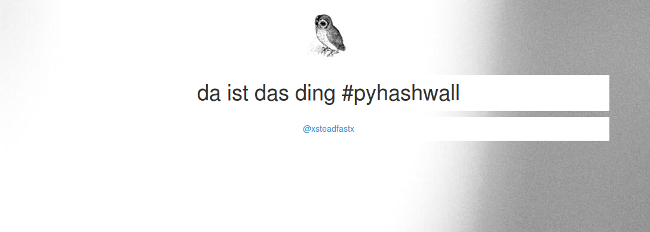

pyhashwall
==========

A try to create a tweetwall in python.

## Usage ##
1. Rename `pyhashwall.conf.dist` to `pyhashwall.conf`
2. Put twitter credentials in
3. `python pyhashwall.py <hashtag>`
4. browse to [http://localhost:5000](http://localhost:5000)
